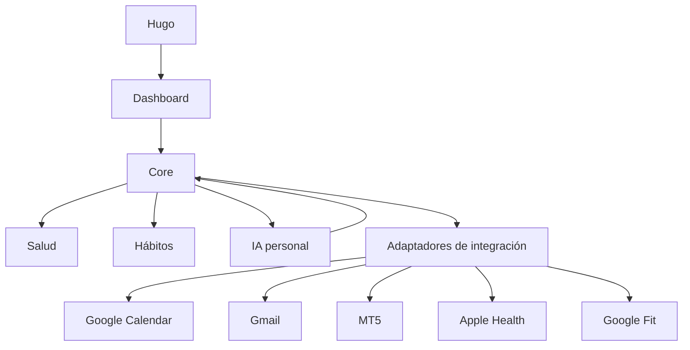

# Hugo OS Blueprint

> Documento rector de producto, arquitectura y forma de trabajo para Hugo AI
> Suite. Define el norte común; cada implementación concreta debe nacer en un
> issue, pasar por revisión y respetar estas reglas.

## 1. Visión del producto

Hugo AI Suite es un **sistema operativo personal asistido por inteligencia
artificial**. Su propósito es reunir información dispersa, convertirla en contexto
útil y ayudar a Hugo a tomar mejores decisiones sobre su tiempo, salud, hábitos,
comunicaciones y proyectos.

El producto debe sentirse como un centro de control personal: claro, confiable,
privado y capaz de crecer por módulos. No busca reemplazar el criterio humano ni
automatizar decisiones sensibles sin supervisión. La IA propone, resume y ayuda a
ejecutar; Hugo conserva siempre el control final.

### Objetivos

- Ofrecer una vista unificada de la vida digital de Hugo.
- Reducir trabajo repetitivo sin perder trazabilidad ni control.
- Transformar datos de distintas fuentes en información accionable.
- Crear una memoria personal útil, explícita y administrable.
- Permitir que cada módulo evolucione sin romper el resto de la suite.

### Límites del producto

- No es un médico ni reemplaza atención profesional.
- No es un asesor financiero ni ejecuta operaciones de inversión por defecto.
- No envía mensajes, modifica calendarios ni realiza acciones críticas sin una
  política de autorización explícita.
- No almacena ni expone más datos personales de los necesarios.

## 2. Roles y autoridad

### Hugo — CEO y Product Owner

- Define la visión, las prioridades y el valor esperado.
- Decide qué problemas se resuelven y en qué orden.
- Aprueba el acceso a datos, cuentas e integraciones externas.
- Revisa los Pull Requests y autoriza los cambios de producción.
- Tiene la decisión final ante cualquier conflicto de alcance, riesgo o diseño.

### ChatGPT — CTO y Arquitecto

- Convierte la visión en propuestas de producto y arquitectura.
- Define contratos, límites de módulos y criterios de aceptación.
- Expone alternativas, riesgos y costos antes de decisiones relevantes.
- Mantiene coherencia entre roadmap, seguridad y evolución técnica.
- Recomienda; no reemplaza la aprobación final de Hugo.

### Codex — Lead Developer

- Implementa issues aprobados dentro del alcance acordado.
- Crea ramas, código, pruebas, documentación, commits y Pull Requests.
- Verifica calidad, seguridad básica y compatibilidad con despliegue.
- Informa bloqueos, supuestos y deuda técnica de forma explícita.
- No introduce secretos, no amplía el alcance por cuenta propia y no toca `main`
  directamente.

## 3. Diccionario oficial

| Término | Definición para Hugo AI Suite |
| --- | --- |
| **Repo** | Repositorio que contiene el código, documentación e historial oficial del proyecto. |
| **Branch** | Línea de trabajo aislada. Permite desarrollar un cambio sin modificar `main`. |
| **Pull Request (PR)** | Solicitud de revisión para incorporar una branch en otra. Incluye cambios, conversación y controles automáticos. |
| **Merge** | Acción de integrar un Pull Request aprobado en la branch de destino. |
| **Commit** | Punto guardado del historial que agrupa cambios relacionados bajo un mensaje descriptivo. |
| **Push** | Envío de commits locales al repositorio remoto en GitHub. |
| **Issue** | Unidad de trabajo que describe un problema, objetivo, alcance y criterios de aceptación. |
| **Sprint** | Periodo de trabajo con un objetivo concreto y un conjunto limitado de issues priorizados. |

## 4. Principios de arquitectura

1. **Modular por diseño.** Cada capacidad de negocio vive en un módulo con límites
   claros, contratos propios y dependencias explícitas.
2. **Monolito modular primero.** Se evita distribuir el sistema antes de necesitarlo.
   Separar servicios será una decisión basada en evidencia, no un punto de partida.
3. **Server-first.** La lógica sensible, los secretos y las integraciones externas
   permanecen en el servidor. El cliente recibe solo lo necesario.
4. **Core independiente de proveedores.** Google, Apple, MetaTrader u otros
   proveedores se conectan mediante adaptadores reemplazables.
5. **Fuente de verdad explícita.** Cada dato tiene un origen, dueño, fecha de
   actualización y política de sincronización conocidos.
6. **Privacidad por defecto.** Se recolecta el mínimo de datos y el acceso requiere
   consentimiento, propósito y capacidad de revocación.
7. **Acciones reversibles.** Las automatizaciones comienzan como sugerencias o modo
   de solo lectura. Las acciones destructivas exigen confirmación.
8. **Observabilidad sin exposición.** Se registran estados y errores útiles, nunca
   tokens, credenciales ni contenido personal innecesario.
9. **Calidad antes del merge.** Tipos, lint, pruebas y build deben estar en verde.
10. **Evolución incremental.** Cada sprint debe entregar una base usable y reducir
    incertidumbre para el siguiente.

## 5. Mapa de alto nivel

El Core coordina identidad, permisos, eventos, configuración y contratos comunes.
El Dashboard compone información; no se convierte en dueño de la lógica de cada
módulo. Las integraciones externas permanecen detrás de adaptadores.

## 6. Módulos principales

| Módulo | Propósito | Primer alcance seguro |
| --- | --- | --- |
| **Core** | Proveer identidad, configuración, permisos, eventos, auditoría y contratos compartidos. | Perfil local, registro de módulos, estados de conexión y modelo de permisos. |
| **Dashboard** | Presentar prioridades, señales y accesos rápidos en una sola vista. | Tarjetas configurables y estados vacíos; sin lógica de negocio propia. |
| **Salud** | Unificar métricas de bienestar y mostrar tendencias comprensibles. | Lectura y visualización; sin diagnósticos ni recomendaciones médicas deterministas. |
| **Hábitos** | Definir rutinas, registrar cumplimiento y detectar patrones. | Creación manual, seguimiento diario y resumen semanal. |
| **Google Calendar** | Incorporar agenda y disponibilidad al contexto personal. | Lectura con permisos mínimos; escritura solo tras confirmación explícita. |
| **Gmail** | Ayudar a priorizar, resumir y preparar comunicaciones. | Metadatos y borradores; nunca enviar ni borrar automáticamente. |
| **MT5** | Mostrar información relevante de MetaTrader 5. | Solo lectura, entorno demo y trazabilidad; ejecución de operaciones fuera del alcance inicial. |
| **Apple Health** | Incorporar datos autorizados del ecosistema Apple. | Adaptador definido tras validar el mecanismo oficial disponible y el consentimiento. |
| **Google Fit** | Incorporar actividad y métricas autorizadas del ecosistema Google. | Adaptador definido tras validar la plataforma oficial vigente y sus permisos. |
| **IA personal** | Convertir el contexto autorizado en explicaciones, resúmenes y sugerencias. | Chat contextual con fuentes visibles, memoria controlable y acciones propuestas, no ejecutadas. |

## 7. Roadmap por sprints

El roadmap expresa una secuencia recomendada. Hugo puede repriorizarlo; cualquier
cambio debe actualizar este documento o el issue rector correspondiente.

### Sprint 1 — Base profesional

- Estructura Next.js, TypeScript y componentes server-first.
- Calidad automática, documentación y despliegue compatible con Vercel.
- Endpoint de salud y fundamentos de seguridad.

**Resultado:** base técnica estable para construir sin rehacer el proyecto.

### Sprint 2 — Core y navegación de producto

- Contratos del Core y registro de módulos.
- Modelo inicial de perfil, preferencias y permisos.
- Shell del Dashboard con navegación y estados vacíos.
- Decisión documentada sobre persistencia y autenticación.

**Resultado:** estructura funcional mínima que conecta UI y dominio.

### Sprint 3 — Hábitos

- Crear, editar y archivar hábitos.
- Registro diario e historial.
- Resumen semanal simple y accesible.
- Pruebas del primer flujo completo de negocio.

**Resultado:** primer módulo usable sin depender de servicios externos.

### Sprint 4 — Salud

- Modelo canónico de métricas y unidades.
- Ingreso manual o datos de prueba controlados.
- Tendencias, procedencia y fecha de actualización.
- Avisos claros sobre límites médicos.

**Resultado:** experiencia de salud validada antes de conectar proveedores.

### Sprint 5 — Google Calendar y Gmail

- OAuth con scopes mínimos y revocables.
- Calendar en modo lectura y propuestas de eventos.
- Gmail con priorización y creación de borradores.
- Auditoría de toda acción propuesta o confirmada.

**Resultado:** primer contexto externo con permisos explícitos.

### Sprint 6 — Apple Health y Google Fit

- Investigación técnica de APIs y políticas vigentes.
- Adaptadores independientes hacia el modelo canónico de Salud.
- Sincronización incremental, deduplicación y controles de privacidad.
- Herramientas para desconectar y eliminar datos importados.

**Resultado:** salud conectada sin acoplar el dominio a un proveedor.

### Sprint 7 — IA personal

- Contrato independiente del proveedor de modelos.
- Respuestas con fuentes y contexto autorizado.
- Memoria explícita: consultar, corregir y eliminar.
- Evaluaciones de calidad, costo, privacidad y resistencia a prompt injection.

**Resultado:** asistente útil y controlable sobre datos confiables.

### Sprint 8 — MT5 y endurecimiento operativo

- Conexión inicial exclusivamente de lectura y con cuenta demo.
- Panel de métricas con procedencia y latencia visibles.
- Revisión de amenazas, recuperación y monitoreo.
- Evaluación separada antes de considerar cualquier acción transaccional.

**Resultado:** información financiera observable sin automatización riesgosa.

## 8. Reglas de seguridad

1. **Nunca versionar secretos.** Claves, tokens, contraseñas y certificados viven
   en gestores de secretos o variables de entorno. `.env.example` contiene solo
   nombres y valores ficticios.
2. **Mínimo privilegio.** Cada integración solicita únicamente los scopes necesarios
   para el caso de uso aprobado.
3. **Consentimiento y revocación.** Hugo debe saber qué se conecta, qué datos se leen
   y cómo desconectarlo o eliminarlos.
4. **Cifrado.** Todo tráfico externo usa TLS; los tokens y datos sensibles se cifran
   en reposo cuando corresponda.
5. **Separación cliente-servidor.** Ningún secreto o token privado usa prefijos o
   mecanismos que lo expongan al navegador.
6. **Redacción de logs.** Los registros no contienen credenciales, correos completos,
   datos de salud detallados ni payloads privados salvo necesidad aprobada.
7. **Confirmación humana.** Enviar correos, crear o eliminar eventos y cualquier
   futura acción financiera requieren una confirmación clara y contextual.
8. **Solo lectura primero.** Toda integración sensible comienza leyendo datos antes
   de habilitar escritura.
9. **Dependencias controladas.** Se mantiene lockfile, auditoría y revisión de
   actualizaciones; no se aplican arreglos forzados que rompan compatibilidad.
10. **Respuesta a incidentes.** Debe ser posible revocar tokens, desactivar un módulo,
    revisar la auditoría y recuperar una versión estable.

## 9. Reglas de trabajo con GitHub

### Regla principal

> **Nunca tocar `main` directamente.**

Todo cambio, incluso documentación o correcciones pequeñas, sigue este flujo:

1. Crear o confirmar un issue con objetivo y criterios de aceptación.
2. Actualizar referencias desde `origin/main`.
3. Crear una branch nueva desde `origin/main`.
4. Implementar únicamente el alcance del issue.
5. Ejecutar los controles correspondientes.
6. Crear commits enfocados con mensajes claros.
7. Hacer push de la branch.
8. Abrir un Pull Request hacia `main`.
9. Esperar revisión y checks en verde.
10. Hacer merge solo con aprobación; nunca de forma automática por un agente.

### Convenciones

- Branches: `feat/...`, `fix/...`, `docs/...`, `refactor/...`, `chore/...`.
- Commits: verbo imperativo y propósito único, siguiendo Conventional Commits.
- No usar `force push` sobre branches compartidas sin acuerdo explícito.
- No mezclar refactorizaciones, features y documentación no relacionada en un PR.
- Todo PR explica qué cambia, por qué, cómo se validó y qué queda fuera.
- `main` debe permanecer desplegable en todo momento.

### Definición de terminado

Un issue está terminado cuando:

- Cumple sus criterios de aceptación.
- No contiene claves ni datos privados.
- Lint, tipos, pruebas aplicables y build están en verde.
- La documentación afectada está actualizada.
- El PR fue revisado y aprobado.
- El merge fue realizado por una persona autorizada.

## 10. Estándares para futuras integraciones

Cada proveedor nuevo debe cumplir estos estándares antes de entrar en producción:

### Contrato y aislamiento

- Definir primero un contrato interno independiente del SDK del proveedor.
- Implementar el proveedor como adaptador reemplazable.
- Traducir datos externos a modelos canónicos del dominio.
- Evitar que componentes de UI importen directamente SDKs externos.

### Autorización y datos

- Documentar autenticación, scopes, expiración y revocación.
- Mantener tokens exclusivamente en el servidor y cifrados cuando corresponda.
- Registrar procedencia, zona horaria y fecha de sincronización de cada dato.
- Definir retención, exportación y eliminación antes de almacenar información real.

### Confiabilidad

- Manejar límites de uso, timeouts, reintentos con backoff e idempotencia.
- Preferir sincronización incremental y evitar duplicados.
- Proveer health checks y estados claros: conectado, degradado, expirado o detenido.
- Usar sandbox, demo o fixtures antes de acceder a cuentas reales.

### Calidad y operación

- Añadir pruebas unitarias del mapeo y pruebas de contrato del adaptador.
- Ocultar nuevas integraciones tras feature flags hasta completar revisión.
- Medir errores, latencia y costo sin registrar contenido sensible.
- Documentar setup, variables, permisos, fallback y procedimiento de desconexión.
- Realizar revisión de privacidad y amenazas para salud, correo y finanzas.

## 11. Gobierno del Blueprint

Este documento es la referencia común para decisiones transversales. No sustituye
los issues ni las especificaciones detalladas. Si una implementación necesita
romper una regla, el cambio debe:

1. Documentar la razón y las alternativas consideradas.
2. Ser aprobado por Hugo.
3. Actualizar este Blueprint mediante un Pull Request separado o claramente
   identificado.

La arquitectura sirve al producto. Debe ser suficientemente firme para proteger
la calidad y suficientemente flexible para aprender de cada sprint.
